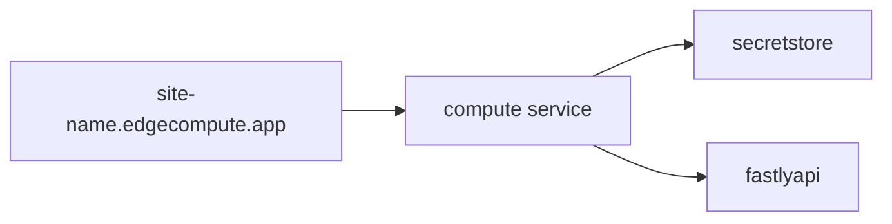
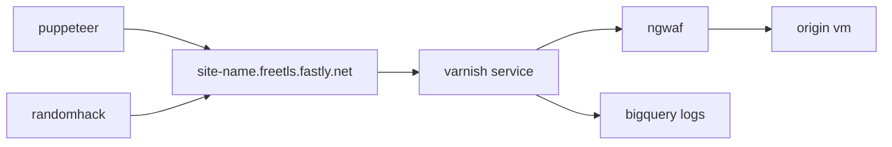

# what is this
- short term: a place for me to learn and rough out minimal examples of fastly products with terraform
- medium term: a foundation on which to build live product demonstrations
- long term: a resource for managing bespoke partner demonstration environments

# what does it do
- deploys a javascript compute@edge application that uses geoip data, a secret-store, and makes an api call
- creates a virtual machine on google cloud, installs magento and the fastly magento plugin
- creates a fastly service with edge rate-limiting, image-optimizaiton and bigquery logging to sit in front of it
- attaches an ngwaf@edge deployment to the service
- spools up some attack tooling to generate traffic and graph data

# diagrams
## edgeapp

## website

# pre-reqs
- a fastly account with the following feature flags enabled
  - `security_ui`
  - `secret_store`
  - `io_entitlement`
  - `rate_limiting` with [hctl commands](https://fastly.atlassian.net/wiki/spaces/CustomerEngineering/pages/50804572197/Rate+Limiting+Enablement#Heavenly-commands%3A)
- a sigsci account (corp)
- a GCP account with access to the SE development project

# howto
## first time setup
chose one of the following three options for where to run this from

### 1 - a github codespace
- click the green "Code" button at the top of the github repo
- click the Codespaces tab within the modal
- click the green "Create codespace..." button
- watch and wait for it to setup (takes ~5m)

### 2 - locally using vscode with a devcontainer
- install the devcontainer extension in vscode
- open this folder in the devcontainer
- wait for it (takes ~5m)
- open another terminal to work in

### 3 - install dependencies on an M1/M2 mac with homebrew
[click here ](README.mac-arm.md)

### configure authentication(s)
- create a fastly api token for your user ([creating api tokens](https://docs.fastly.com/en/guides/using-api-tokens#creating-api-tokens))
- configure the fastly cli with it   
    `fastly profile create`  
- configure the google terraform provider's access  
    `gcloud auth application-default login`
- click on the file named `terraform.tfvars` in the left menu and populate its values
  - use the same fastly api key from the cli (`fastly profile token`)
  - populate the two `magento_repo` variables ([see here for how to get them](https://experienceleague.adobe.com/docs/commerce-operations/installation-guide/prerequisites/authentication-keys.html))  
  - populate the three `sigsci_` variables ([see here for how to create an api key](https://docs.fastly.com/signalsciences/developer/using-our-api/#managing-api-access-tokens))

## test loop
- `terraform apply`
- click the links
- `terraform destroy`

## cleanup (if using codespaces)
- in the same github web modal that you created the codespace you will now see it listed with a random name
- click the "..." next to it
- click Delete
