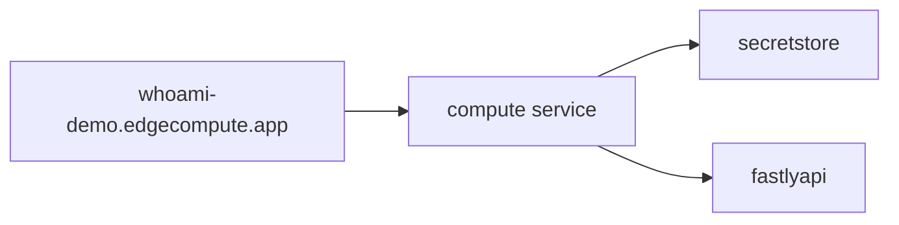
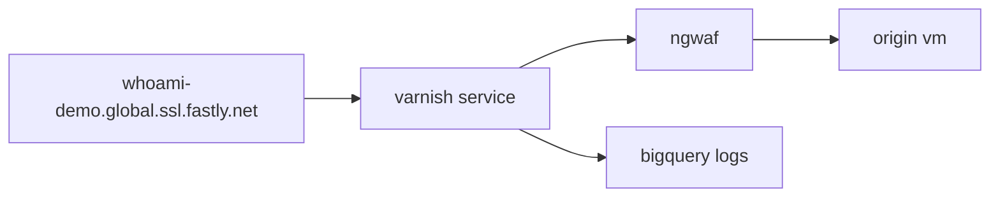
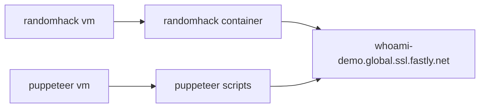
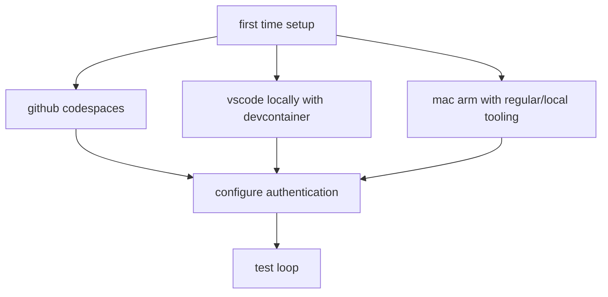

# fsly demo

## what is this
- short term: a place for me to learn and rough out minimal examples of fastly products with terraform
- medium term: a foundation on which to build live product demonstrations
- long term: a resource for managing bespoke partner demonstration environments

## what does it do
- deploys a javascript compute@edge application that uses geoip data, a secret-store, and makes an api call
- creates a virtual machine on google cloud, installs magento and the fastly magento plugin
- creates a fastly service with edge rate-limiting, image-optimizaiton and bigquery logging to sit in front of it
- attaches an ngwaf@edge deployment to the service
- spools up some attack tooling to generate traffic and graph data

## diagrams

## pre-reqs
- a fastly account with the following feature flags enabled
  - `security_ui`
  - `secret_store`
  - `io_entitlement`
  - `rate_limiting` with [hctl commands](https://fastly.atlassian.net/wiki/spaces/CustomerEngineering/pages/50804572197/Rate+Limiting+Enablement#Heavenly-commands%3A)
- a sigsci account (corp)
- a GCP account with access to the SE development project

## howto

### first time setup
#### if using a github codespace
- press the `.` key while on this page (in github)
- click the three-lines menu button in the top left corner -> terminal -> new terminal
- click the top button to launch a codespace
- chose a 2-core VM
- watch and wait for it to setup (takes ~5m)

#### if using vscode locally with devcontainer
- install the devcontainer extension in vscode
- open this folder in the devcontainer
- wait for it (takes ~5m)
- open another terminal to work in

#### if using a mac (arm) with regular/local tooling
- open a terminal
- install homebrew ([docs](https://brew.sh/))  
  `/bin/bash -c "$(curl -fsSL https://raw.githubusercontent.com/Homebrew/install/HEAD/install.sh)"`
- install fastly, terraform and other cli tools  
  `brew install fastly terraform vegeta jq`
- install npm ([docs](https://github.com/nvm-sh/nvm#installing-and-updating))  
  `curl -o- https://raw.githubusercontent.com/nvm-sh/nvm/v0.39.4/install.sh | bash`  
  `export NVM_DIR="$HOME/.nvm"`
  `[ -s "$NVM_DIR/nvm.sh" ] && \. "$NVM_DIR/nvm.sh"`  
  `nvm install node`
- gcloud cli ([docs](https://cloud.google.com/sdk/docs/install-sdk#mac))  
  `curl -o https://dl.google.com/dl/cloudsdk/channels/rapid/downloads/google-cloud-cli-442.0.0-darwin-arm.tar.gz`  
  `tar xf google-cloud-cli-*`  
  `./google-cloud-sdk/install.sh`
- clone this repo and cd into it

#### configure authentication(s)
- create a fastly api token for your user ([creating api tokens](https://docs.fastly.com/en/guides/using-api-tokens#creating-api-tokens))
- configure the fastly cli with it   
    `fastly profile create`
- create a second fastly api token with read-only access (for the edgeapp)
- put the read-only api token in `edgeapp/.secrets`
- configure the gcloud cli  
    `gcloud auth login` - for you to be able to use the gcloud cli  
    `gcloud auth application-default login` - for the google terraform provider to be able to sue the gcp sdk  
    `gcloud config set project <projectname>`  
    `gcloud config set compute/region us-east1`  
    `gcloud config set compute/zone us-east1-b`  
- if you don't already have them, generate a defatult ssh keypair (codespace/devcontainer setups will not)  
    `ssh-keygen`
- copy the example environment variables file to start your own local one (which will be ignored by git)  
  `cp .env.example .env`
- edit `.env`
  - populate the two `TF_VAR_magento_repo` variables ([see here for how to get them](https://experienceleague.adobe.com/docs/commerce-operations/installation-guide/prerequisites/authentication-keys.html))  
  - populate the three `SIGSCI_` variables ([see here for how to create an api key](https://docs.fastly.com/signalsciences/developer/using-our-api/#managing-api-access-tokens))
- `terraform init`

### test loop
- `source .env`
- `terraform apply`
- do your thing
- `terraform destroy`

## wishlist
- integrate dcorbett's sqli demo
- figure out how to demonstrate purging
- figure out how to demonstrate edge rate limiting
- figure out how to demonstrate live stats and logs
- figure out how to demonstrate fast config changes
- figure out how to demonstrate websockets
- figure out how to demonstrate the frustration of latency
