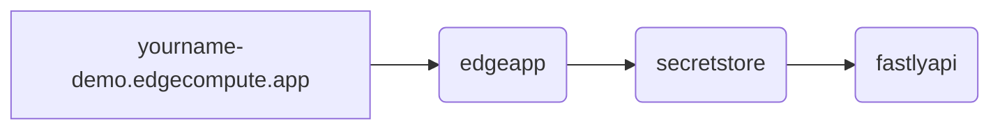

# fsly demo

## what is this
- short term: a place for me to learn and rough out minimal examples of fastly products with terraform
- medium term: a foundation on which to build live product demonstrations
- long term: a resource for managing bespoke partner demonstration environments

## what does it do
- deploys a javascript compute@edge application that uses geoip data, a secret-store, and makes an api call
- creates a virtual machine on google cloud, installs magento and the fastly magento plugin
- creates a fastly service with edge rate-limiting, image-optimizaiton and bigquery logging to sit in front of it
- attaches an ngwaf@edge deployment to the service
- spools up some attack tooling to generate traffic and graph data

## pre-reqs
- a fastly account with the following feature flags enabled
  - `security_ui`
  - `secret_store`
  - `io_entitlement`
  - `rate_limiting` with [hctl commands](https://fastly.atlassian.net/wiki/spaces/CustomerEngineering/pages/50804572197/Rate+Limiting+Enablement#Heavenly-commands%3A)
- the fastly cli, configured with an api token with engineer or higher permission [howto docs link](https://developer.fastly.com/learning/tools/cli/#installing)
- another api token with read-only access and user or higher permission (for the edgeapp) [creating api tokens](https://docs.fastly.com/en/guides/using-api-tokens#creating-api-tokens)
- a sigsci account (corp)
- an api key from that corp
- a GCP account with access to the SE development project
- the gcloud cli tool installed and authenticated
`gcloud auth application-default login`
- terraform
- vegeta
- jq
- npm

## howto
### first time setup
- clone this repo and cd into it
- `terraform init`
- `cp .env.example .env`
- edit `.env`
  - populate the two `TF_VAR_magento_repo` variables ([see here for how to get them](https://experienceleague.adobe.com/docs/commerce-operations/installation-guide/prerequisites/authentication-keys.html))
  - populate the three `SIGSCI_` variables
  - validate the `gcloud` commands have the underlying values configured
- put the read-only api token in `edgeapp/.secrets`

### test loop
- `source .env`
- `terraform apply`
- do your thing
- `terraform destroy`

## wishlist
- integrate dcorbett's sqli demo
- figure out how to demonstrate purging
- figure out how to demonstrate edge rate limiting
- figure out how to demonstrate live stats and logs
- figure out how to demonstrate fast config changes
- figure out how to demonstrate websockets
- figure out how to demonstrate the frustration of latency